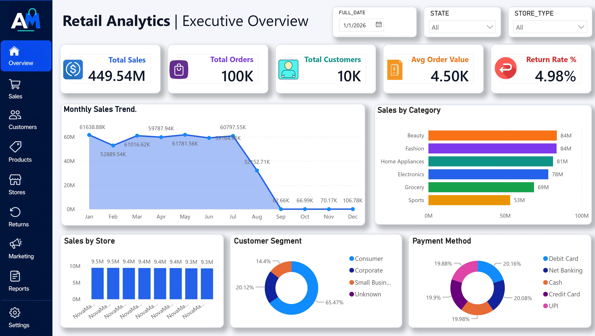
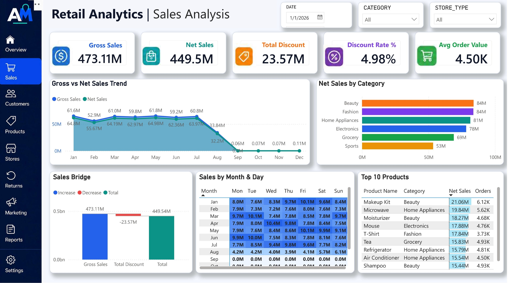
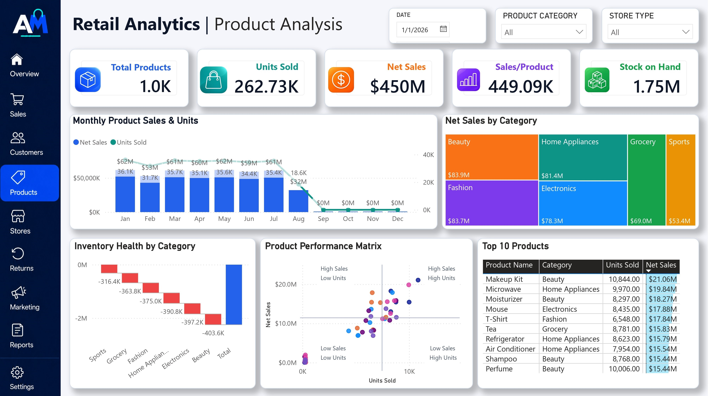
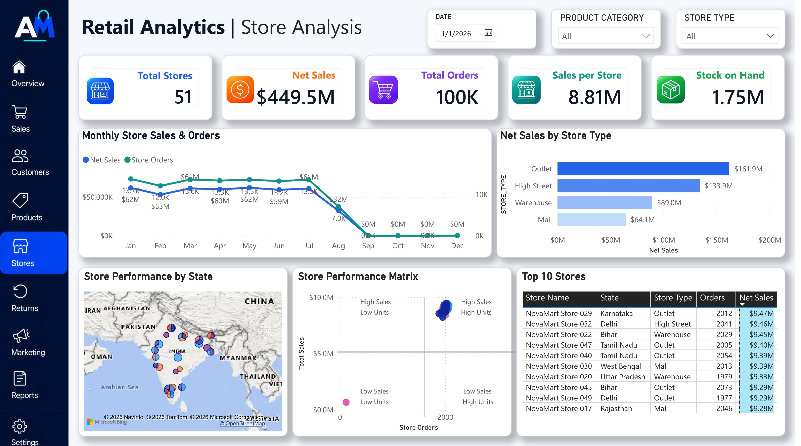

# Abhra Mart Retail Analytics

## Project Overview

Abhra Mart Retail Analytics is an end-to-end retail data analytics project developed using **Snowflake, Snowpark Python, SQL, Power BI and DAX**.

The project transforms raw retail data into a structured dimensional model and an interactive Power BI dashboard that helps business stakeholders monitor sales, customers, products, stores, payments, inventory and returns.

### Executive Overview Dashboard



### Sales Analysis Dashboard



### Customer Analysis Dashboard


### Customer Analysis Dashboard



### Store Analysis Dashboard



## Business Objectives

- Monitor overall sales and order performance
- Identify monthly sales trends
- Compare product category and store performance
- Understand customer segments
- Analyse payment-method distribution
- Track return rates and inventory availability
- Support data-driven retail decision-making

## Tools and Technologies

- **Snowflake** – Cloud data warehouse
- **Snowpark Python** – Data cleaning, validation and transformation
- **SQL** – Data preparation and dimensional modelling
- **Power BI** – Data modelling and dashboard development
- **DAX** – KPI and business-metric calculations
- **GitHub** – Project documentation and version control

## Project Architecture

```text
Raw Retail Data
        ↓
Snowflake Staging Layer
        ↓
Snowpark Python and SQL Transformations
        ↓
Dimensional Data Model
        ↓
Power BI and DAX
        ↓
Interactive Business Dashboard
